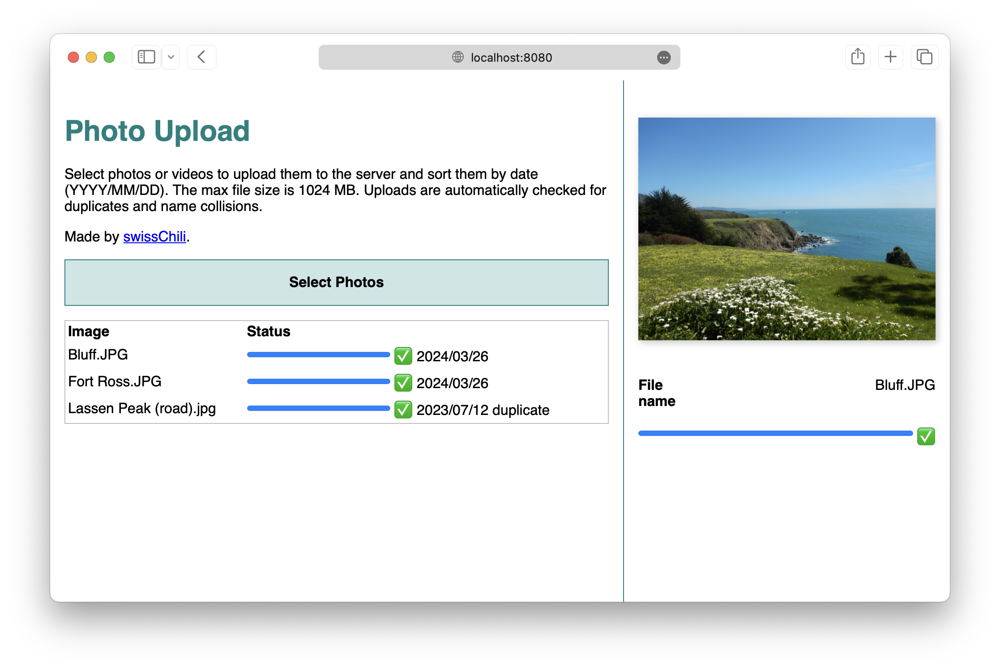

# Photo Upload

This is a web app that lets you upload photos to a server and sorts them by date taken.

In my case, I have a large photo library organized as `Photos/2021/02/34/DSC_1234.jpg`.
This web app lets me upload `DSC_1234.jpg`, extracts the date taken (`2021-02-34`)
from the EXIF metadata embedded in the image, and stores the picture in the right
directory.

This app has some other nice features:

- **Incremental file upload**: large files are split into chunks and sent in parallel,
  making uploads faster and more reliable. The uploader works well even with hundreds of
  files and gigabytes of total upload data.
  In the future I will also implement resumable uploads.
- **Batch upload**: upload hundreds of files at a time, or drag and drop whole folders
  of photos.
- **Duplicate and collision checking**: the server checks for duplicate photos and for
  name collisions between different photos. No files are ever deleted or overwritten in
  case of collision.
- **Mobile-responsive interface**: the web app is designed to work well on mobile devices,
  both in terms of UI and data transfer over limited bandwidth/poor latency.
  (See `demo_mobile.png` for the mobile UI)
